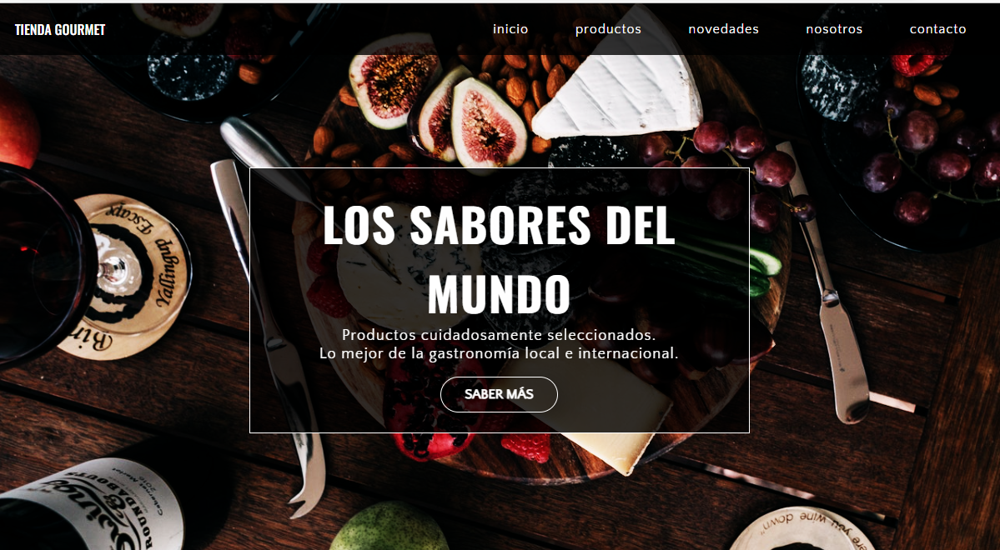

# TPO-TIENDA CODO A CODO

## Autora

 Lorena Frias

## Github repo

[TPO-TIENDA](https://github.com/LorenaFrias/tpo-tienda)

## Sitio Web

[TPO-TIENDA-CODO-A-CODO](https://tpo-tienda-codo-a-codo.netlify.app/)

## Tech Stack

Client: HTML, CSS, Vanilla JavaSCript

## Estructura de carpeta

Index.html, main.js , style.css y README son los archivos en el root folder.

Se incluye además screenshot y un archivo readme con los requisitos del trabajo práctico.

La carpeta assets contiene imágenes.